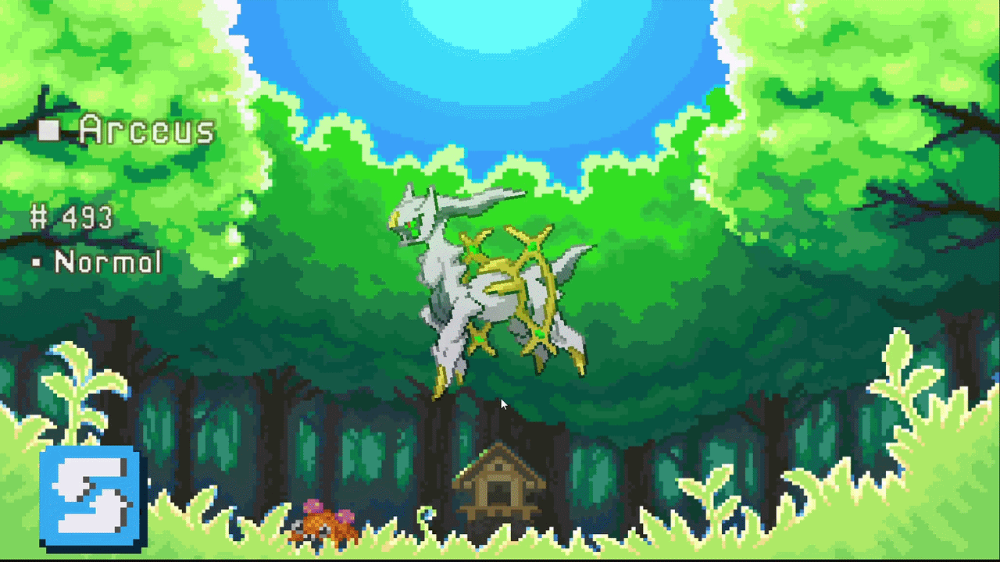

# 📱 Unity REST API Example using Pokémons

A study prototype developed in Unity focused on consuming real-time data from an external API and presenting it through an animated and responsive UI, inspired by the Pokémon games interface.

---

## 🧩 Technologies Used

- `Unity Engine (C#)`
- `PokéAPI` – External API used to retrieve Pokémon data (name, sprites, types, audio)  
- `UnityWebRequest` – Handling asynchronous API calls and asset downloads  
- `DOTween` – UI animations and visual feedback (scale, fade, sway, sequencing)  
- `TextMeshPro` – UI text rendering  
- `Unity UI` – Interface structure and layout system  

---

## ✨ Features

- 🔄 Random Pokémon generation  
- 🌐 Real-time API integration  
- 🖼️ Dynamic sprite loading  
- 🔊 Pokémon cry playback  
- ⭐ Configurable **Shiny system**  
- 🎨 Animated UI with DOTween  
- 🧩 Code structured with **SOLID principles**  

---

## 🧠 Architecture

The project was structured to separate responsibilities:

- **APIController**  
  Handles API calls and flow control  

- **CharacterView**  
  Manages UI elements and animations  

- **CharacterAudioPlayer**  
  Controls audio playback  

- **UtilitiesUI**  
  Shared helper methods (alpha, texture scaling, formatting)  

---

## 🎬 Animations

UI animations were designed to simulate a Pokédex-like reveal:

- Scale "pop-in" effect  
- Progressive fade-in  
- Subtle rotation (sway)  
- Sequential type reveal  
- Audio sync with animation  

---

## 🌟 Shiny System

- Configurable chance via Inspector  
- Shiny Pokémon have:  
  - Highlighted name ⭐  
  - Different color  
  - Alternate sprite  

---

## 🚀 How to Run

1. Clone the repository  
2. Open the project in Unity  
3. Configure:
   - Pokémon ID range  
   - Shiny chance  
4. Play the scene 🎮  

---

## 📦 API

Data provided by:  
https://pokeapi.co/

---

## 👁️ Final Notes

This project is **non-commercial** and was created for **learning purposes and skill improvement**, focusing on architecture, UI systems, and real-time data integration.  

---
